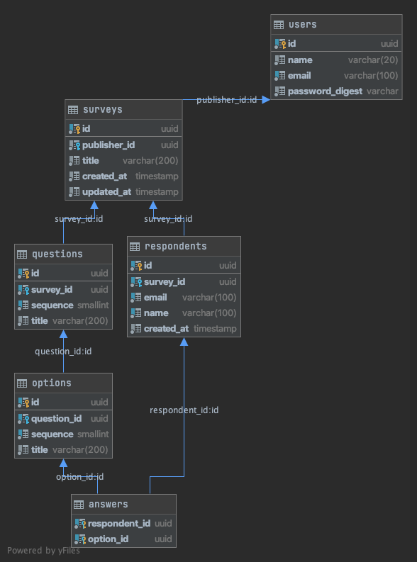

# Survey application

This project contains both server and client applications.

Server application is written in Go, client application is written in TypeScript and uses Next.js as a framework.

## How to start

Following command involves building docker image and running docker containers.

This command requires several minutes (perhaps close to 10 minutes) to finish because both server and client applications have to install dependent libraries and build source codes.

```bash
$ make build-and-start
```

Then open `http://localhost:3000`.

### Test users

When applications are started by above command, test users will be created automatically. These are the login information of test users.

|  Email  |  Password  |
| ---- | ---- |
|  user1@dummy.com  |  password  |
|  user2@dummy.com  |  password  |
|  user3@dummy.com  |  password  |

## Remove docker containers

Since above command starts several docker containers, please run following command to remove containers after using applications.

```bash
$ make remove-containers
```

### Documentation

While server application is running, you can access api documentation at the following URL.

`http://localhost:8080/swagger/index.html`

## Entity–relationship diagram

